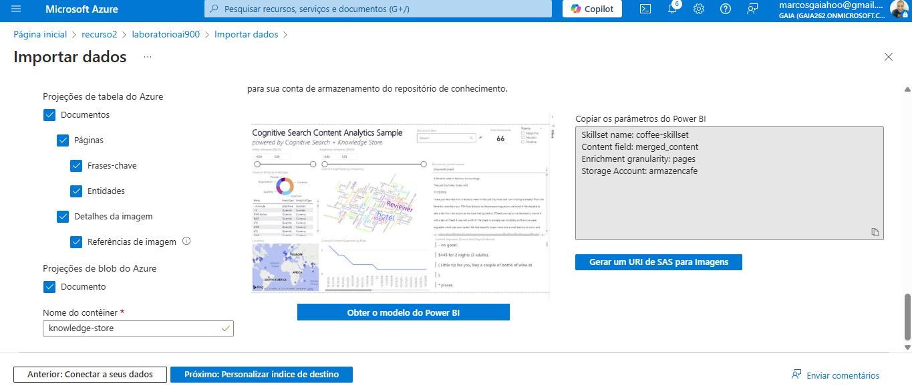
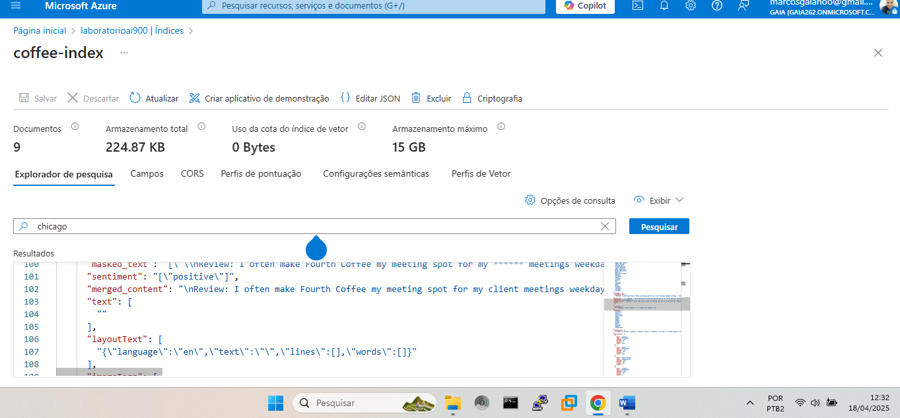
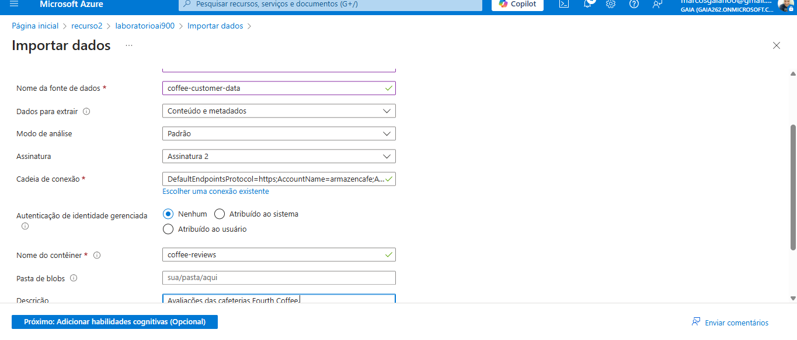
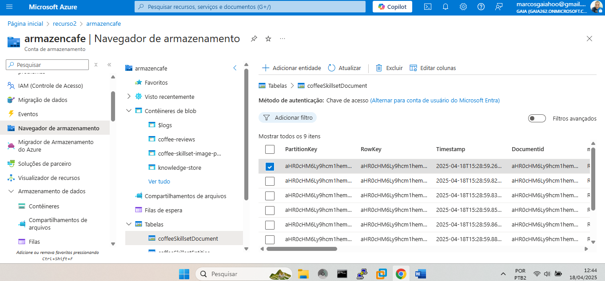
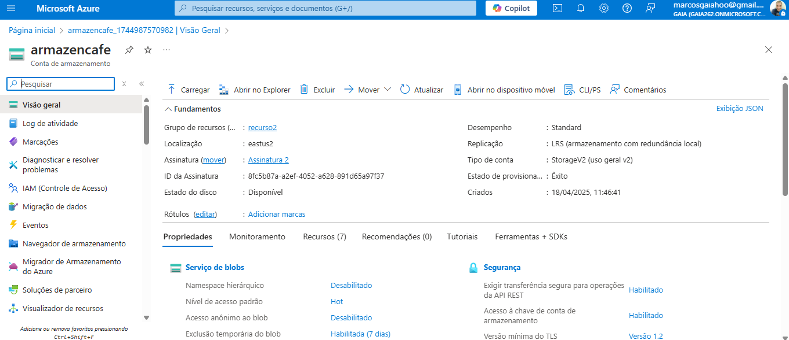
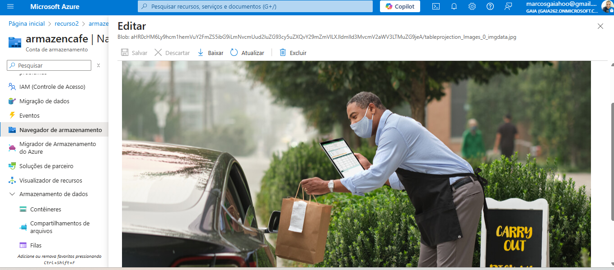
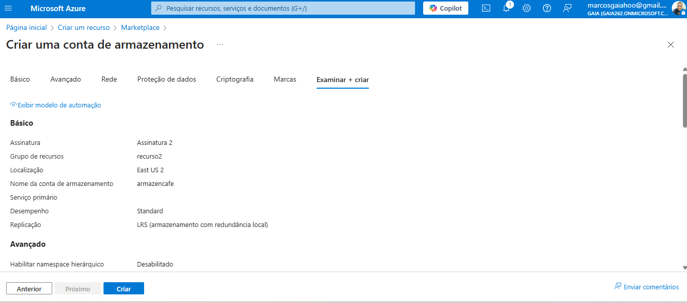
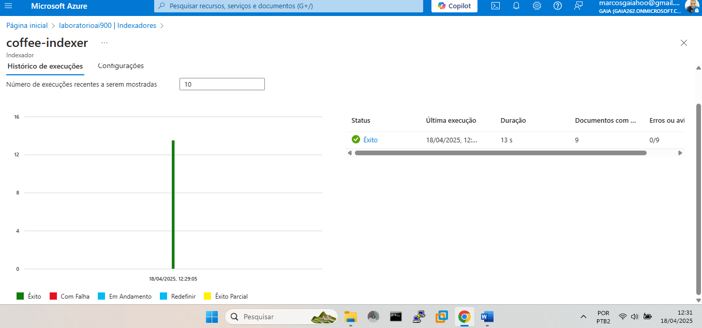
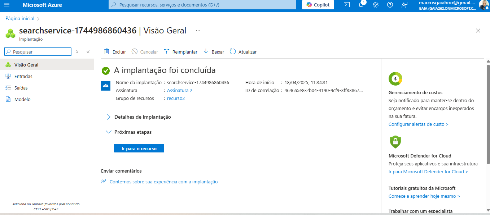
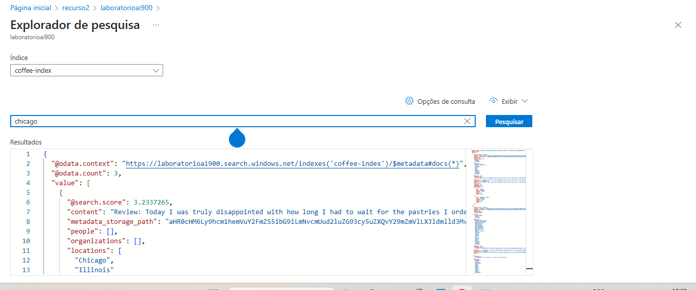

# 🚀 Projeto - Azure AI Customer Feedback Search

Este repositório contém a documentação e evidências da execução do **Lab 11: Explore an Azure AI Search index (UI)**, parte da trilha **Microsoft Learn AI Fundamentals**, feito como desafio prático.

---

## 📌 Objetivo

Criar uma solução de indexação inteligente com **Azure Cognitive Search**, integrando:
- Azure Blob Storage
- Azure AI Skills (OCR, extração de chave, sentimento, etc.)
- Indexador automático
- Consulta com Search Explorer

---

## 🧰 Recursos utilizados

- **Azure Cognitive Search** (Free Tier)
- **Azure Blob Storage**
- Documentos `.pdf` e `.json`
- Interface do portal Azure

---

## 📸 Prints da execução

Os prints com todas as etapas da execução estão abaixo:

1. 
2. 
3. 
4. 
5. 
6. 
7. 
8. 
9. 
10. 

---

## 📍 Etapas realizadas

1. Criação de Storage Account com container de documentos
2. Upload de arquivos (ex: reviews)
3. Importação de dados via **wizard do Azure Search**
4. Configuração de skillset com:
   - OCR
   - Sentiment Analysis
   - Key Phrase Extraction
   - Image Tagging
5. Geração automática do índice e indexador
6. Consulta no Search Explorer
7. Verificação dos dados enriquecidos no índice

---

## ⚠️ Observação sobre Base64

> A opção “Chaves de Codificação Base-64” **não aparece mais** na interface atual do Azure.  
> Isso ocorre porque a plataforma já interpreta arquivos binários automaticamente.  
> O tutorial oficial da Microsoft ainda menciona essa opção, mas está desatualizado.

---

## 📄 Referência oficial

- [Microsoft Learn - Lab 11: Explore AI Search Index](https://microsoftlearning.github.io/mslearn-ai-fundamentals/Instructions/Labs/11-ai-search.html)

---

## 👤 Autor

**Marcos Gaia**  
Repositório: [github.com/marcosgaia](https://github.com/marcosgaia)  
Desenvolvido como parte da trilha de aprendizado com foco em inteligência artificial na nuvem.
